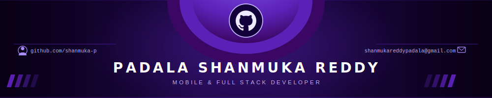

<p align="center">
  
</p>

<p align="center">
  
</p>

<p align="center">
  
  &nbsp;
  
</p>

---

# 👤 About Me


```yaml
name      : Padala Shanmuka Reddy
role      : Mobile & Full Stack Developer
location  : India

currently :
  - 🔭 Building AI-integrated Flutter applications
  - 🌱 Mastering State Management (BLoC, GetX, Provider)
passion   : "Apps that solve real-world problems with AI"
```

<br clear="right"/>

---

## 🛠️ Tech Stack

<table align="center">
  <tr>
    <td align="center" width="200"><strong>📱 Mobile &amp; Frontend</strong></td>
    <td align="center">
      
    </td>
  </tr>
  <tr>
    <td align="center"><strong>⚙️ Backend &amp; Cloud</strong></td>
    <td align="center">
      
    </td>
  </tr>
  <tr>
    <td align="center"><strong>🗄️ Databases</strong></td>
    <td align="center">
      
    </td>
  </tr>
  <tr>
    <td align="center"><strong>🔧 Languages &amp; Tools</strong></td>
    <td align="center">
      
    </td>
  </tr>
</table>

---

## 🚀 Featured Projects

<table align="center">
  <thead>
    <tr>
      <th>🏆 Project</th>
      <th>📝 Description</th>
      <th>🔧 Stack</th>
    </tr>
  </thead>
  <tbody>
    <tr>
      <td><strong>🤖 AI Mentor Path</strong><br/><em>(Hoot App)</em></td>
      <td>Engineered the "AI Mentor" feature for a campus hackathon app. Integrated LLMs via OpenRouter API to generate personalized learning paths based on LSRW analytics. Deployed on Render with scalable cloud infra.</td>
      <td><code>Flutter</code> <code>Node.js</code> <code>MongoDB</code> <code>OpenRouter</code> <code>Render</code></td>
    </tr>
    <tr>
      <td><strong>📚 StudyMate</strong></td>
      <td>Real-time collaborative study platform with Google Gemini AI for auto-generating summaries &amp; quizzes from PDFs. Features live video conferencing via Zego Cloud SDK in a 4-person agile team.</td>
      <td><code>Flutter</code> <code>Supabase</code> <code>Gemini API</code> <code>Zego SDK</code> <code>Syncfusion</code></td>
    </tr>
    <tr>
      <td><strong>🏥 MedEase</strong></td>
      <td>Comprehensive telemedicine app with RBAC via Firebase Firestore, appointment scheduling, and an NLP-powered chatbot that improved user engagement by <strong>40%</strong>.</td>
      <td><code>Flutter</code> <code>Firebase</code> <code>REST APIs</code> <code>Provider</code></td>
    </tr>
  </tbody>
</table>

<p align="center">
  <a href="https://github.com/Shanmuka-p?tab=repositories">
    
  </a>
</p>

---

## 📊 GitHub Stats

<p align="center">
  
  &nbsp;
  
</p>

<p align="center">
  
</p>

---

## 📈 Contribution Activity

<p align="center">
  
</p>

---

## 🐍 Contribution Snake

<p align="center">
  
</p>

---

## 🌐 Connect With Me

<p align="center">
  <a href="mailto:[shanmukareddypadala@gmail.com]">
    
  </a>
  &nbsp;
  <a href="https://www.linkedin.com/in/padala-shanmuka-reddy">
    
  </a>
  &nbsp;
  <a href="https://github.com/Shanmuka-p">
    
  </a>
</p>

---

<p align="center">
  
</p>

<p align="center">
  <em>⚡ "Engineering AI-powered mobile experiences that matter — one commit at a time." ⚡</em>
</p>
